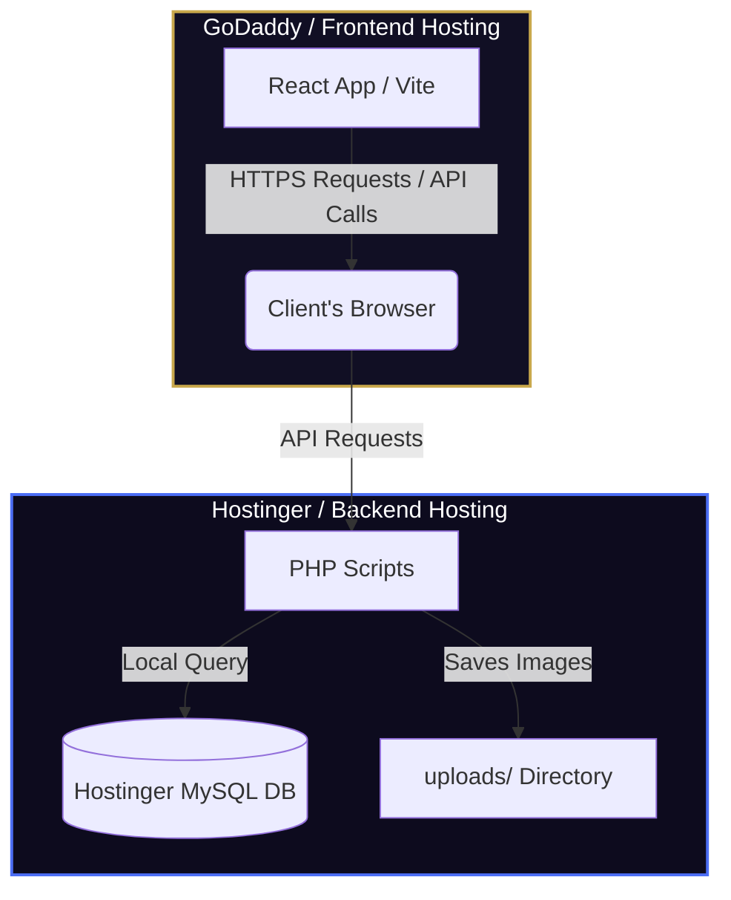

# 🚀 Ahlaad 2K26 — Deployment & Connection Guide

This guide explains how to host your **React Frontend** (on GoDaddy, Netlify, or any other hosting) and your **PHP Backend** (on Hostinger), and how they will connect to each other seamlessly.

---

## 🗺️ Architectural Overview

Modern web applications separate the **Frontend** and the **Backend** into two independent layers:



*   **Frontend (GoDaddy):** A bundle of static files (HTML, CSS, JS) that is loaded entirely by the user's browser.
*   **Backend (Hostinger):** Dynamic PHP scripts executing on Hostinger servers, storing data in the MySQL database, and returning JSON.

---

## 🛠️ Step 1: Deploying the PHP Backend (Hostinger)

Your backend PHP files are located in the `backend/` folder of your project.

### 1. Upload Backend Files
1. Log in to your **Hostinger hPanel**.
2. Go to **File Manager** for your domain.
3. Locate the `public_html` folder.
4. Create a folder named `backend` (so the path is `public_html/backend`).
5. Upload all files and folders inside your local `backend/` directory (including `uploads/` folder and all `.php` files) into this new `public_html/backend` directory.

> [!IMPORTANT]
> Make sure the `public_html/backend/uploads/` directory has write permissions (set permissions to `755` or `777` in Hostinger File Manager) so that payment proof screenshots can be uploaded successfully.

### 2. Configure Database Connection
Your `db_config.php` is already configured to connect to Hostinger's Remote MySQL database:
```php
define('DB_HOST', '148.222.53.74'); // Hostinger Remote MySQL IP
define('DB_USER', 'u213825351_ahlaad');
define('DB_PASS', 'Pandiit@6253'); 
define('DB_NAME', 'u213825351_ahlaad');
```
Because `db_config.php` has self-initializing tables (`CREATE TABLE IF NOT EXISTS`), **visiting any backend PHP URL for the first time will automatically create and configure all necessary tables for you!** No manual SQL import is necessary!

---

## 💻 Step 2: Configuring & Building the Frontend (GoDaddy)

Before building your React frontend, you need to configure it to point to your live Hostinger backend.

### 1. Update the Production Environment File
1. Open the `.env.production` file in your root folder.
2. Change the `VITE_API_BASE_URL` to point to your live Hostinger domain's backend folder:
   ```env
   VITE_API_BASE_URL=https://your-hostinger-domain.com/backend
   ```
   *(Replace `your-hostinger-domain.com` with your actual Hostinger website domain.)*

### 2. Build the Production Bundle
Run the production build command in your terminal:
```bash
npm run build
```
This will compile and optimize your React app, generating a production-ready `dist/` folder in your root directory containing:
*   `index.html`
*   `assets/` (bundled Javascript, CSS, and images)
*   Static images from the `public/` directory

### 3. Deploy to GoDaddy / Frontend Hosting
1. Log in to your **GoDaddy Hosting Control Panel (cPanel)** or your alternative frontend hosting platform.
2. Go to **File Manager** and open `public_html`.
3. Upload the **contents** of the generated `dist/` directory (not the folder itself, but everything inside it) directly into `public_html`.

---

## 🔒 Step 3: Crucial Security & Connectivity Rules

### 1. SSL / HTTPS (Extremely Important)
Both domains **must** use the same protocol. Modern browsers block requests from an HTTPS website to an HTTP API (this is called a "Mixed Content Error").
*   If your GoDaddy website is `https://your-godaddy-site.com`,
*   Your Hostinger API **MUST** also be `https://your-hostinger-domain.com/backend`.
*   Ensure free SSL certificates are activated on both hostings!

### 2. CORS (Cross-Origin Resource Sharing)
By default, web browsers block web pages from making requests to a different domain. Since your frontend is on GoDaddy and your backend is on Hostinger, this is a **Cross-Origin** request.

To allow this, all your PHP scripts in `backend/` are pre-configured to send CORS headers:
```php
header("Access-Control-Allow-Origin: *");
header("Access-Control-Allow-Headers: Content-Type, Access-Control-Allow-Headers, Authorization, X-Requested-With");
header("Access-Control-Allow-Methods: POST, GET, OPTIONS");
```
The `*` allows requests from any domain, ensuring GoDaddy can communicate with Hostinger out of the box!

---

## 🧪 Step 4: Verification Checklist

Once uploaded, you can verify your connection is working:
1. Open your Hostinger API status in your browser: `https://your-hostinger-domain.com/backend/get_timeline.php`. It should return a clean JSON string containing the initial events.
2. Open your live GoDaddy website and register a test user.
3. Open your browser's Developer Tools (Press `F12` -> Go to `Network` tab) to inspect the API requests and verify they return `200 OK` from Hostinger.
